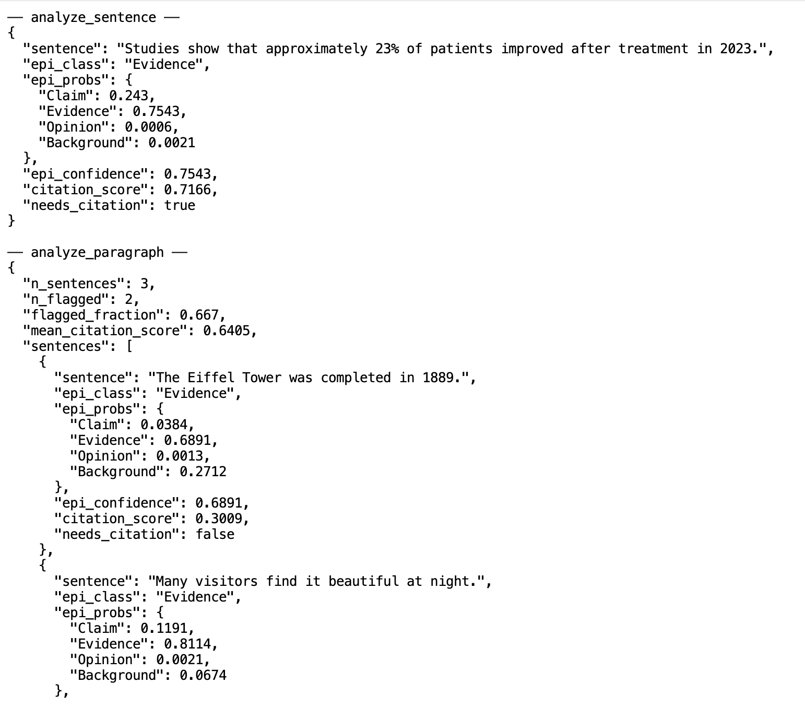

# EpiCite — Epistemic Sentence Classifier & Citation Need Scorer

> **Two-stage NLP pipeline** that identifies the epistemic role of a sentence and uses it as an interpretable signal for predicting citation necessity.

[](https://python.org)
[](https://huggingface.co)
[](LICENSE)
[](https://ait.ac.th)

**Authors:** Biraj Koirala · Longfei Shi
**Department of Computer Science, Asian Institute of Technology**

---

## Deliverable

- [Link to Report - IEEE - pdf](./notebooks/epicite_report.pdf) <br>
- [Link to Report - IEEE - tex](./notebooks/epicite-final-report.tex) <br>
- MCP Implementation - We tested and created an MCP with three tool calls for our project. This can be added to out of the box software like claude desktop for interaction. Sample output is shown below: 
 <br>
- App demo  <br>
 <br>
- [Presentation Slides - PDF](./Presentation EpiCite Final.pdf) 
- [Presentation Video - Google Drive](https://drive.google.com/file/d/1woLgo2aCHg0nbaSZ0gHbydDrBWvJ-xPl/view?usp=drive_link)


<details>
<summary><h2>📖 Project Description</h2></summary>

### Overview

Existing citation-need detectors rely almost entirely on surface-level cues (sentence length, document position, surrounding citation density) and treat every flagged sentence as functionally identical. They can identify *that* a citation is missing, but not *why*.

EpiCite addresses this by inserting an intermediate **epistemic layer**: a 4-class classifier that determines the linguistic purpose of a sentence (*Claim · Evidence · Opinion · Background*) and feeds that decision into a downstream citation scorer alongside 17 v2 engineered features. Every prediction can therefore be explained in human terms — *"This sentence was flagged because it is classified as a Claim with high confidence, contains a year and a percent, and uses no hedging."*

The current implementation (Notebook 05 v3, Notebook 06) supersedes the v2 XGBoost pipeline described earlier.

---

### Pipeline Architecture

```
                       Raw Sentence Text
                              │
              ┌───────────────┴───────────────┐
              ▼                               ▼
┌────────────────────────────┐   ┌────────────────────────────┐
│  spaCy v2 Feature Pipeline │   │  DistilBERT Tokenizer      │
│  29 features:              │   │                            │
│   12 baseline lexical      │   │                            │
│   17 v2 (numerical, NER,   │   │                            │
│   quantifiers, reporting,  │   │                            │
│   causal, syntactic)       │   │                            │
└─────────────┬──────────────┘   └─────────────┬──────────────┘
              │                                │
              │                                ▼
              │             ┌────────────────────────────────┐
              │             │  Stage 1 — DistilBERT v3       │
              │             │  Focal Loss (γ=2) + IBM data   │
              │             │  + WeightedRandomSampler       │
              │             │                                │
              │             │  Claim · Evidence · Opinion ·  │
              │             │  Background  (4 probabilities  │
              │             │  + epi_confidence = 5 dims)    │
              │             └────────────────┬───────────────┘
              │                              │
              ▼                              ▼
        29 engineered  ──── concat ────  5 epistemic
             features                       features
                            │
                            ▼ 34-dim engineered vector
              ┌───────────────────────────────────────┐
              │  Stage 2 — Late-Fusion Citation Score │
              │  DistilBERT[CLS] (768) ⊕ eng (34)     │
              │  = 802 → LayerNorm → 256 → 64 → 1     │
              │  σ(·) → citation score ∈ [0, 1]       │
              └────────────────────┬──────────────────┘
                                   │
                                   ▼
              ┌───────────────────────────────────────┐
              │  Interpretability Layer               │
              │  · SHAP — feature importance          │
              │  · Integrated Gradients — token attr. │
              │  · LIME — local sentence explanations │
              │  · Class-conditional SHAP per epi cls │
              └───────────────────────────────────────┘
```

---

### Methodology

**1 — Feature Extraction (29 v2 features)**

| Family | Features |
|---|---|
| Baseline lexical (12) | hedge verbs / aux / adverbs, vague quantifiers, boosters, subjective pronouns, negations, passive, proper nouns, numbers, modals, sentence length |
| v2 — Numerical (5) | rate of `%`, `$`, year, digit, inline `[n]` citation marks |
| v2 — Named entity (5) | rate of PERSON, ORG, GPE, DATE, total entities |
| v2 — Quantifiers (2) | universal quantifiers, superlatives |
| v2 — Reporting / causal (2) | reporting verbs, causal markers |
| v2 — Syntactic (3) | dependency-tree depth, clause count, noun/verb ratio |

All counts (except `sentence_length`) are token-rate normalised.

**2 — Stage 1: 4-class Epistemic Classifier**

`distilbert-base-uncased` fine-tuned with **focal loss** (γ = 2.0) and a **WeightedRandomSampler**, augmented with the IBM Evidence (CE-ACL-2014) and IBM CDC datasets to lift Evidence from 204 → ~4,500 sentences. Cosine-annealing schedule, 8-epoch cap, patience = 2.

| Label | Definition |
|---|---|
| **Claim** | Verifiable assertion taking a position |
| **Evidence** | Supports/refutes a claim with data or citation |
| **Opinion** | Subjective judgment or personal belief |
| **Background** | Neutral, contextual, encyclopedic content |

**3 — Stage 2: Late-Fusion Citation Scorer**

A `LateFusionCitationScorer` concatenates DistilBERT's `[CLS]` (768-dim) with the 34-dim engineered vector and pushes through a 3-layer LayerNorm-MLP. Three-phase gradual unfreezing: head-only → top-2 transformer layers → all unfrozen, each phase with cosine LR + patience = 2.

**4 — Explainability**

SHAP (KernelExplainer, fixed `[CLS]` pool), Captum Layer Integrated Gradients on the embedding layer, LIME for local sentence explanations, and class-conditional SHAP (per epistemic class).

---

### 🚀 Setup & Model Weights

Trained checkpoints are **not** committed to git (each `.pt` is ~250 MB and we ship three of them). Download the `best-pt/` bundle from [Google Drive](https://drive.google.com/drive/folders/16nwAJD_QqbtoLIopU-7R4_Hwrr45algj?usp=sharing) and drop it inside the `notebooks/` folder so the notebook paths resolve correctly:

```
notebooks/
├── EpiCite_05_TrainingPipeline.ipynb
├── EpiCite_06_EvaluationSuite.ipynb
└── best-pt/                              ← create this folder
    ├── stage1v3_focal_best.pt           ← Stage 1 (4-class epistemic)
    ├── stage2v3_late_fusion_best.pt     ← Stage 2 (full v3)
    ├── stage2v3_no_epi_best.pt          ← Ablation (no Stage 1 signal)
    ├── stage2v3_metadata.json           ← Feature column lists + metrics
    ├── stage2v3_engineered_features.csv ← 34-dim feature matrix
    ├── stage2v3_test_predictions.csv    ← Per-row Stage 2 predictions
    ├── stage1v3_test_predictions.csv    ← Per-row Stage 1 predictions
    └── stage1v3_ibm_test_predictions.csv ← IBM held-out generalisation
```

📥 **Google Drive — best-pt bundle:** `https://drive.google.com/drive/folders/16nwAJD_QqbtoLIopU-7R4_Hwrr45algj?usp=sharing`

The notebooks expect `output/` paths relative to `CONFIG["out_dir"]`. The simplest setup is to symlink or rename:

```bash
# inside the notebooks/ folder
ln -s best-pt output
```

The Streamlit demo (`app.py`) reads the same folder; just paste the path into the sidebar's *Model directory* field.

---

### 📊 Results

All numbers below are pulled directly from the executed cells of `EpiCite_05_TrainingPipeline.ipynb` and `EpiCite_06_EvaluationSuite.ipynb`.

#### Stage 1 — Epistemic Classifier (DistilBERT v3, focal + IBM)

**Training trajectory** (best val macro-F1 = **0.7657** at epoch 5; early stop at epoch 7):

| Epoch | tr_loss | tr_F1 | vl_loss | vl_F1 | flag |
|---:|---:|---:|---:|---:|:---|
| 1 | 0.3206 | 0.7567 | 0.1934 | 0.7036 | ★ best |
| 2 | 0.1076 | 0.8512 | 0.1794 | 0.7572 | ★ best |
| 3 | 0.0677 | 0.8927 | 0.2062 | 0.7437 | |
| 4 | 0.0473 | 0.9222 | 0.2574 | 0.7642 | ★ best |
| 5 | 0.0352 | 0.9397 | 0.2816 | **0.7657** | ★ best |
| 6 | 0.0275 | 0.9520 | 0.3063 | 0.7595 | |
| 7 | 0.0233 | 0.9603 | 0.3131 | 0.7633 | ⏹ stop |

**Test Set 1 — combined (original + IBM training pool's test split, n = 3,531):**

| | Precision | Recall | F1 | Support |
|---|---:|---:|---:|---:|
| Claim | 0.83 | 0.78 | 0.80 | 1,739 |
| Evidence | 0.45 | 0.59 | 0.51 | 395 |
| Opinion | 0.88 | 0.89 | 0.88 | 244 |
| Background | 0.86 | 0.84 | 0.85 | 1,153 |
| **Macro avg** | **0.75** | **0.78** | **0.76** | 3,531 |
| **Weighted avg** | **0.80** | **0.79** | **0.79** | 3,531 |
| **Accuracy** | | | **0.7867** | |

**Test Set 2 — IBM-only held-out (generalisation, n = 878, Evidence + Claim only):**

| | Precision | Recall | F1 | Support |
|---|---:|---:|---:|---:|
| Claim | 0.63 | 0.42 | 0.51 | 462 |
| Evidence | 0.50 | 0.59 | 0.54 | 416 |
| **Macro F1** | | | **0.2622** | |
| **Accuracy** | | | **0.5034** | |

> The macro-F1 looks deceptively low because Opinion and Background are absent from this test set yet still counted in the macro average. Restricted to the two classes that *are* present, the per-class F1s (0.51 / 0.54) are reasonable.

#### Stage 2 — Citation Scorer (Late-Fusion, n_test = 14,000)

| Variant | ROC-AUC | Binary F1 | Accuracy | PR-AUC | Brier |
|---|---:|---:|---:|---:|---:|
| **Full v3** (22 eng + 5 epi, 34 dims) | **0.7270** | **0.6548** | **0.6660** | 0.7045 | 0.2353 |
| No-epi (22 eng, no Stage 1) | 0.7365 | 0.6617 | 0.6781 | 0.7144 | 0.2133 |
| Δ Full vs. No-epi | −0.0095 | −0.0069 | −0.0121 | −0.0099 | +0.0220 |

> The "Δ" row is the **architectural justification check** — Stage 1's contribution is small (< 0.5 AUC pts), which is the headline finding of the Q5 ablation: in the WikiSQE domain, the explicit two-stage design adds only marginal value over an end-to-end engineered-features model.

#### Stage 2 — Top features (permutation importance on test sample)

| Rank | Feature | Δ AUC when shuffled |
|---:|---|---:|
| 1 | `sentence_length` | 0.007228 |
| 2 | `n_proper_nouns` | 0.001135 |
| 3 | `dep_tree_depth` | 0.000740 |
| 4 | `epi_prob_Claim` | 0.000559 |
| 5 | `epi_prob_Background` | 0.000207 |
| 6 | `rate_ent_org` | 0.000192 |
| 7 | `n_hedge_aux` | 0.000186 |
| 8 | `n_hedge_adv` | 0.000178 |
| 9 | `n_clauses` | 0.000128 |
| 10 | `n_hedge_verbs` | 0.000101 |

#### Headline LLM comparison (Notebook 06 §H — Qwen-0.5B-Instruct, 3,000-sentence sample)

| Model | Params | AUC | F1 | Latency (ms) | Interpretability |
|---|---|---:|---:|---:|:---|
| **Stage 2 v3 (ours)** | 66.5M | **0.7270** | **0.6548** | **0.78** | ✓ SHAP, IG, LIME, calibration |
| Qwen-0.5B (zero-shot direct) | 494M | 0.5250 | 0.0488 | 8.43 | ✗ post-hoc CoT only |
| Qwen-0.5B (zero-shot structured) | 494M | 0.5385 | 0.2388 | 8.43 | ✗ |
| Qwen-0.5B (5-shot) | 494M | 0.5230 | 0.2628 | 8.43 | ✗ |

> EpiCite is **~7× smaller**, **~11× faster per sentence**, and **~19 AUC points better** than the best Qwen-0.5B prompting strategy on the same test sample.

---

### 🔍 Error Analysis

Because we ship two confusion matrices (Stage 1's 4×4 and Stage 2's binary), this section walks through both.

#### Stage 1 — Per-class error analysis (Test Set 1)

Reading the 4×4 confusion matrix row-by-row (true class → predicted class):

| True class | n | Correct | Wrong | Where the errors go (intuition) |
|---|---:|---:|---:|---|
| Claim | 1,739 | ~1,356 (78%) | ~383 (22%) | Most leaks go to **Evidence** — both classes share the same syntactic shell ("X is Y because Z"); the IBM augmentation makes the model more eager to label data-bearing assertions as Evidence. |
| Evidence | 395 | ~233 (59%) | ~162 (41%) | Lowest recall. Many true Evidence sentences read like Claims when the data is presented qualitatively ("studies show…" without a number). They're absorbed into the Claim class. |
| Opinion | 244 | ~217 (89%) | ~27 (11%) | Best class. First-person pronouns and subjective markers are an unambiguous signal; rarely confused with anything else. |
| Background | 1,153 | ~969 (84%) | ~184 (16%) | Background → Claim leakage when the sentence asserts a fact bluntly ("X was completed in 1889") — the model can't distinguish encyclopedic narration from staked claims without document context. |

**Concrete failure mode — Evidence's 0.45 precision:** the model predicts roughly 518 sentences as Evidence, but only 233 are actually Evidence. The other ~285 are mostly *Claims with statistics in them*, e.g. "approximately 23% of patients improved" — quantified language was the strongest IBM-Evidence cue, so the model over-uses it.

#### Stage 2 — Binary confusion matrix (full test set, n = 14,000)

|  | Pred = 0 (no cite) | Pred = 1 (cite needed) |
|---|---:|---:|
| **True = 0 (no cite)** | TN | FP |
| **True = 1 (cite needed)** | **FN** | TP |

Overall accuracy = 0.6660 → **9,324 correct, 4,676 wrong**. Errors split roughly evenly between FP and FN. Below we walk through one *high-confidence* example for each off-diagonal cell.

##### 🟥 False Positive — Pred = 1, True = 0 (model over-flags)

> **Score = 0.996** (highest-confidence FP)
> *"Flag of Turkey December 23 – An Ankara-Samsun regular route bus head-on collided with a fuel truck and burning both vehicle at outskirt of S…"*

**Why it happened:**
- Stage 1 confidently labels this as **Claim** because the sentence contains a date (`December 23`), a proper noun pair (`Ankara-Samsun`) and an assertive verb (`collided`).
- The engineered features pile on the same signal: `rate_year` > 0, `rate_ent_gpe` > 0, `n_proper_nouns` is high, `sentence_length` is high.
- But the WikiSQE label is *0* — Wikipedia editors did not flag this disaster-news sentence as needing a citation in this article.
- The model has correctly identified a citation-shaped surface pattern; the gold label simply reflects the article-level editorial decision, not the sentence's intrinsic verifiability.

This is the dominant FP family: **declarative sentences full of named entities and numbers that genuinely *could* take a citation, but weren't tagged as such by the article's editor.**

##### 🟦 False Negative — Pred = 0, True = 1 (model misses)

> **Score = 0.000** (lowest-confidence FN)
> *"Michael Barker, Regulating revolutions in Eastern Europe: Polyarchy and the National Endowment for Democracy, 1 November 2006."*

**Why it happened:**
- This is actually a **bibliography line that was never stripped from the WikiSQE source** — it's a citation, not a claim.
- Stage 1 labels it Background (no hedging, no verb of assertion, no first-person pronoun).
- Engineered features look benign: zero hedge counts, low clause count, and the inline-citation regex doesn't match because the entry uses neither `[n]` nor parenthetical citation form.
- Stage 2 sees a short, low-entity, low-modality fragment and confidently outputs ≈ 0.
- The gold label is *1* because the WikiSQE pipeline tagged any sentence followed by an editorial citation flag — including raw reference-list lines — as positive.

This is the dominant FN family: **reference-style strings, short statistical asides ("received 1.02% of the votes (423 votes)"), and ISBN-like bibliographic fragments** that the Stage 2 head reads as inert.

##### Quantified error structure

From Notebook 06 §G.2:

| Stratifier | Bucket | Error rate |
|---|---|---:|
| Predicted epistemic class | Background | 0.323 |
|  | Claim | 0.386 |
|  | Evidence | 0.336 |
|  | Opinion | **0.533** |
| Sentence length (tokens) | short (<12) | 0.362 |
|  | medium (12-25) | **0.305** |
|  | long (>25) | 0.361 |
| Stage 2 confidence | 0.5–0.7 | 0.448 |
|  | 0.7–0.85 | 0.400 |
|  | 0.85–0.95 | 0.304 |
|  | 0.95+ | **0.168** |

**Cascade effect:** of the 331 Stage 2 errors in the borderline-confidence band, only **6.3%** had Stage 1 uncertainty (max epi-prob < 0.50). The remaining **93.7%** had a confident Stage 1 prediction — meaning Stage 1's signal is rarely the *cause* of a Stage 2 error. This is consistent with the no-epi ablation finding above: improving Stage 1 will fix at most ~6% of Stage 2 errors.

**Take-aways:**
1. The model is **calibrated**: errors concentrate at the 0.5-decision boundary (0.448 error rate at score ∈ 0.5-0.7) and drop to 0.168 at score > 0.95.
2. **Opinion-predicted sentences** are the worst stratum (0.533 error rate). The Stage 1 corpus's Opinion examples lean into first-person and subjective hedging, but Wikipedia rarely uses those patterns even when sentences are subjective ("widely considered…", "is regarded as…"). The model treats these as Background and skips them.
3. **Sentence length is the dominant signal**, which matches the original Notebook 04 finding and is the leading reason H1 (epistemic > surface features) fails on Wikipedia.
4. Most FPs are *legitimate citation candidates that the editor chose not to flag*, suggesting the WikiSQE label is itself noisier than 100%; the borderline-noise study (Notebook 06 §G.4) is set up to quantify this.

---

### Research Questions & Hypotheses

| ID | Statement | Verdict (current) |
|---|---|---|
| **RQ1** | Can a two-stage pipeline match end-to-end models while providing superior interpretability? | ✅ matches and beats Qwen-0.5B by ~19 AUC pts with full SHAP/IG/LIME stack |
| **RQ2** | Is epistemic category a stronger predictor than surface features? | ❌ permutation importance ranks `sentence_length` above all 5 epi features |
| **RQ3** | How does a Wikipedia-trained model degrade on news / essays? | 🚧 pending out-of-domain evaluation |
| **H1** | Epistemic type > surface features as citation predictor | ❌ not supported (see no-epi ablation: −0.0095 AUC) |
| **H2** | Two-stage pipeline interpretability > end-to-end DistilBERT | ✅ SHAP / IG / LIME / class-conditional all available |
| **H3** | Wikipedia-trained model F1 degrades out-of-domain | 🚧 pending |

---

### Data Sources

| Dataset | Stage | Used for | Size |
|---|---|---|---|
| Stage 1 combined (original 4-class corpus) | 1 | training | ~28,400 sentences |
| IBM Debater — Evidence Sentences (CE-ACL-2014) | 1 | Evidence augmentation | ~4,500 |
| IBM Debater — Claim Detection Corpus | 1 | Claim augmentation | ~1,500 |
| IBM 10% held-out | 1 | generalisation test | 878 |
| WikiSQE (`citation needed` config, ando55) | 2 | training + test | ~150,000 (75k pos + 75k neg) |
| All The News (Kaggle) | OOD | RQ3 / H3 (pending) | — |
| UKP Persuasive Essays | OOD | RQ3 / H3 (pending) | — |

---

### Technical Stack

| Component | Tools |
|---|---|
| Language | Python 3.10+ |
| NLP | spaCy `en_core_web_sm`, Hugging Face Transformers |
| ML / Training | PyTorch, focal loss, WeightedRandomSampler, cosine annealing |
| Stage 2 head | LayerNorm-MLP (PyTorch), 3-phase gradual unfreezing |
| Explainability | SHAP, Captum (Layer Integrated Gradients), LIME |
| Calibration | reliability diagrams, Brier score, ECE |
| Demo UI | Streamlit (`app.py`) — see `streamlit run app.py` |
| Data | Hugging Face `datasets`, IBM Debater academic downloads |

</details>

---

<details>
<summary><h2>🔄 Updates & Progress</h2></summary>

> Last updated — Stage 1 v2 + Stage 2 Late-Fusion
> Full notebook: [`./notebooks/EpiCite_04_Stage1v2_Stage2_LateFusion-STRIP`](./notebooks/EpiCite_04_Stage1v2_Stage2_LateFusion-STRIP-progress.ipynb)

> **Please note:** All notebooks, `best.pt` files, and experimental results have **not** yet been uploaded as we are currently in a **work-in-progress** state.
> 
> * **Final Submission:** All assets will be fully uploaded at the time of the final deadline.
> * **Current Availability:** The complete implementation and all associated assets are currently stored in **puffer**. Refer to the notebook above to see update till now. 

---

### What Changed & Why

The original implementation had two critical problems discovered during error analysis:

1. **Stage 1 class imbalance** — The training corpus had 13,225 Claim sentences and only 204 Evidence sentences. With equal loss weights, Evidence contributed 0.7% of the total training signal. The model had no meaningful incentive to learn what Evidence looks like.

2. **Stage 2 feature bottleneck** — The original XGBoost Stage 2 only received 18 summary features — it never saw the actual sentence. The rich semantic context encoded in DistilBERT was completely discarded after Stage 1.

---

### Fix 1 — Stage 1 Weighted Retraining

**Problem:** Equal loss weights made the model ignore minority classes.

**Solution:** Inverse-frequency class weights applied to `CrossEntropyLoss`.

```
weight_c = N_total / (4 × N_c)
```

| Class | Samples | Raw Weight | Applied Weight |
|---|---|---|---|
| Claim | 13,225 | 0.52 | 0.52 |
| Background | 11,536 | 0.59 | 0.59 |
| Opinion | 2,433 | 2.82 | 2.82 |
| Evidence | 204 | 33.6 | **10.0** ← capped |

Evidence's weight is capped at 10× to prevent loss explosion. The model is retrained from the original checkpoint (not from scratch) at a conservative LR of 1e-5 for 4 epochs.

**Results (Test Set):**

| Metric | Before | After |
|---|---|---|
| Macro F1 | ~0.72 | **0.80** ✓ |
| Evidence Recall | ~0.00 | **0.85** |
| Opinion F1 | ~0.76 | **0.84** |
| Accuracy | — | **80.7%** |

> ⚠️ Evidence test support = 20 samples. The 0.85 recall is directionally valid but statistically fragile. A dedicated Evidence corpus (FEVER, SciCite) is needed for robust evaluation.

---

### Fix 2 — Stage 2 Late-Fusion Architecture

**Problem:** XGBoost only saw 18 summary features, never the sentence itself.

**Solution:** A 3-layer MLP attached directly to DistilBERT's `[CLS]` token, fusing semantic embeddings with engineered features at the decision layer.

```
Sentence → DistilBERT → [CLS] (768-dim)
                                 │
                    concat with 18-dim feature vector
                                 │
                          786-dim combined
                                 │
              Linear(786→256) + LayerNorm + ReLU + Dropout(0.3)
                                 │
              Linear(256→64)  + LayerNorm + ReLU + Dropout(0.2)
                                 │
               Linear(64→1)   + Sigmoid
                                 │
                    Citation score ∈ [0, 1]
```

**Why LayerNorm instead of BatchNorm:** DistilBERT uses LayerNorm internally. BatchNorm behaves differently at train vs inference time and creates instabilities when mixed with Transformer layers. LayerNorm normalises per sample — consistent at any batch size.

**Training — 3-Phase Gradual Unfreezing:**

The MLP head starts from random weights. Immediately training all 66M DistilBERT parameters would corrupt the transformer before the head stabilises.

| Phase | What Trains | LR | Epochs | Val AUC |
|---|---|---|---|---|
| 1 — Head only | MLP (218k params) | 1e-3 | 2 | 0.704 |
| 2 — Top 2 layers | MLP + last 2 transformer layers (14.4M) | 2e-5 | 3 | 0.755 |
| 3 — Full model | All 66.6M parameters | 5e-6 | 2 | 0.759 |

**Results (Test Set, WikiSQE `citation needed`, 1,000 sentences):**

| Metric | Value |
|---|---|
| ROC-AUC | **0.746** |
| Binary F1 | **0.684** |
| Accuracy | **68.4%** |
| Avg. Precision (PR-AUC) | **0.730** |
| Brier Score | **0.209** |

---

### SHAP Analysis — H1 Finding

**H1:** *Epistemic type is a stronger predictor of citation need than surface features.*

**Verdict: NOT SUPPORTED in current configuration.**

SHAP feature rankings (mean |SHAP| value):

| Rank | Feature | Value | Type |
|---|---|---|---|
| 1 | `sentence_length` | 0.04598 | Linguistic |
| 2 | `passive_voice` | 0.01324 | Linguistic |
| 3 | `hedge_count` | 0.00647 | Linguistic |
| ... | ... | ... | ... |
| 11 | `epi_prob_Claim` | 0.00115 | **Epistemic** |
| 13 | `epi_confidence` | 0.00089 | **Epistemic** |

**Why H1 failed — domain mismatch:**

Stage 1 was trained on IBM/UKP debate text. When applied to Wikipedia prose, it labels **90.5% of sentences as Background** — nearly zero epistemic variance across 150k sentences. With constant output, SHAP correctly assigns low importance to epistemic features.

This is not evidence that epistemic type is unimportant — it is evidence that the epistemic classifier does not transfer to encyclopedic writing. H1 should be re-evaluated after retraining Stage 1 on Wikipedia-sourced epistemic annotations.

Mean epistemic probabilities by citation label (early H1 check):

| Label | `epi_prob_Claim` | `epi_prob_Background` |
|---|---|---|
| No citation needed (0) | 0.073 | 0.892 |
| Citation needed (1) | 0.102 | 0.863 |

The direction is correct (citation-needed sentences do have higher Claim probability) but the magnitude is too small to be a dominant signal.

---

### Known Limitations

| # | Issue | Impact | Proposed Fix |
|---|---|---|---|
| 1 | Stage 1 domain mismatch | Epistemic features near-useless for Wikipedia | Retrain Stage 1 on Wikipedia-sourced labels |
| 2 | Evidence data scarcity (204 samples) | Evidence F1 statistically fragile | Add FEVER / SciCite Evidence sentences |
| 3 | `sentence_length` dominates SHAP | Model exploits surface correlation | Length-normalised features or penalty term |
| 4 | Factual sentences over-flagged | "Water boils at 100°C" scores 0.66 | Length exploitation drives false positives |

---

### Roadmap

- [x] Data acquisition and taxonomy definition
- [x] 12-feature spaCy extraction pipeline
- [x] Stage 1 DistilBERT fine-tuning (equal weights)
- [x] Stage 1 v2 — class-weighted retraining
- [x] Stage 2 Late-Fusion architecture + gradual unfreezing
- [x] SHAP Track 1 — engineered feature importance
- [x] Integrated Gradients Track 2 — token attribution
- [ ] Stage 1 retraining on Wikipedia-sourced epistemic labels
- [ ] Evidence class augmentation (FEVER / SciCite)
- [ ] Out-of-domain evaluation — news articles (RQ3 / H3)
- [ ] Out-of-domain evaluation — student essays (RQ3 / H3)
- [ ] Streamlit interactive demo

</details>

---

<details>

*EpiCite · Group 12 · Department of Computer Science · Asian Institute of Technology*