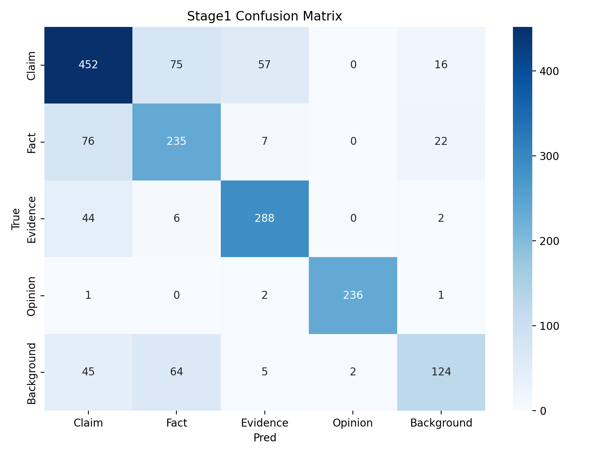

# Stage1 Results

## Environment
- GPU: NVIDIA GeForce RTX 2060
- PyTorch: 2.2.2+cu121

## Baseline vs Fine-tuned
| Model | Val macro-F1 | Test macro-F1 | Test accuracy |
|---|---:|---:|---:|
| Frozen CLS + LR | 0.6989 | 0.7010 | 0.6858 |
| Fine-tuned DistilBERT (best seed=123) | 0.7689 | 0.7638 | 0.7585 |

## Seed Stability
- Test macro-F1 mean±std: 0.7616 ± 0.0022
- Test accuracy mean±std: 0.7555 ± 0.0026

## Per-class Metrics (Best Checkpoint)
| Class | Precision | Recall | F1 |
|---|---:|---:|---:|
| Claim | 0.7314 | 0.7533 | 0.7422 |
| Fact | 0.6184 | 0.6912 | 0.6528 |
| Evidence | 0.8022 | 0.8471 | 0.8240 |
| Opinion | 0.9916 | 0.9833 | 0.9874 |
| Background | 0.7515 | 0.5167 | 0.6123 |

## Confusion Matrix

## Key Confusions
- Fact vs Evidence confusion rate: 1.91%
- Claim vs Evidence confusion rate: 10.74%

## Top Error Patterns
1. Evidence and Fact overlap on entity-heavy declarative sentences.
2. Claim and Evidence overlap when claims are phrased as support statements.
3. Opinion is occasionally confused with Fact when subjective cues are weak.